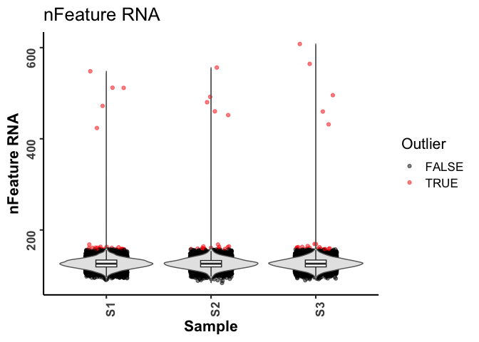

scoutR
================

``` r
#----- Skip if you already have seurat-data instaled
remotes::install_github("satijalab/seurat-data")
#> Skipping install of 'SeuratData' from a github remote, the SHA1 (3e51f443) has not changed since last install.
#>   Use `force = TRUE` to force installation
```

``` r
library(scoutR)
library(Seurat)
library(Matrix)
library(purrr)

#----- Set a directory to hold outputs
outputDir <- c("/Users/mike/Desktop/")
```

To highlight the functionalities of `scoutR` we will generate 3 dummy
Seurat objects that mimic real-life data

``` r

library(Matrix)
set.seed(42)

simulate_seurat_object <- function(n_cells, sample_name) {
  # Simulate sparse count matrix
  expr <- rpois(n = 2000 * n_cells, lambda = 1)
  expr[sample(length(expr), size = length(expr) * 0.9)] <- 0  # Sparsify
  mat <- Matrix::Matrix(data = expr, nrow = 2000, ncol = n_cells, sparse = TRUE)
  rownames(mat) <- paste0("Gene", 1:2000)
  colnames(mat) <- paste0(sample_name, "_cell", 1:n_cells)

  # Create Seurat object
  seu <- CreateSeuratObject(counts = mat, project = sample_name)

  # Simulate QC metadata
  seu$nFeature_RNA <- Matrix::colSums(mat > 0)
  seu$nCount_RNA <- Matrix::colSums(mat)
  seu$percent.mt <- rnorm(n_cells, mean = 5, sd = 2)

  # Inject outliers (5 random cells)
  outlier_cells <- sample(colnames(seu), size = 5)
  seu$nFeature_RNA[outlier_cells] <- seu$nFeature_RNA[outlier_cells] * 4
  seu$nCount_RNA[outlier_cells] <- seu$nCount_RNA[outlier_cells] * 6
  seu$percent.mt[outlier_cells] <- seu$percent.mt[outlier_cells] + 20

  return(seu)
}

# Create 3 dummy datasets
dummySamples <- list(
  S1 = simulate_seurat_object(n_cells = 9234, sample_name = "S1"),
  S2 = simulate_seurat_object(n_cells = 6763, sample_name = "S2"),
  S3 = simulate_seurat_object(n_cells = 7996, sample_name = "S3")
)
```

Let’s quickly examine the structure of the list of Seurat objects

``` r
dummySamples
#> $S1
#> An object of class Seurat 
#> 2000 features across 9234 samples within 1 assay 
#> Active assay: RNA (2000 features, 0 variable features)
#>  1 layer present: counts
#> 
#> $S2
#> An object of class Seurat 
#> 2000 features across 6763 samples within 1 assay 
#> Active assay: RNA (2000 features, 0 variable features)
#>  1 layer present: counts
#> 
#> $S3
#> An object of class Seurat 
#> 2000 features across 7996 samples within 1 assay 
#> Active assay: RNA (2000 features, 0 variable features)
#>  1 layer present: counts
```

We can now merge the metadata across these 3 objects to generate one
master metadata table using the `mergeMetadata` function

``` r
metadata <- mergeMetadata(dummySamples)

colnames(metadata)
#> [1] "orig.ident"   "nCount_RNA"   "nFeature_RNA" "percent.mt"   "cell_id"

#----- Get a vector of unique samples
samples <- unique(metadata$orig.ident)
colors <- c("#00AFBB", "#E7B800", "#FC4E07")
```

We can plot a violin plot for an individual metadata category of
interest.

``` r

#----- As a violin plot
qcViolin(metadata = metadata, 
         variable = "nFeature_RNA",
         logTransform = FALSE,
         sampleColors = colors,
         figDir = outputDir, 
         width = 6,
         height = 6)
```

<!-- -->

We can also pair this function with `ggarrange` to plot multiple
variables at a time. The function will save each variable as a
standalone plot, but the merged plot can be saved with `ggplot::ggsave`

``` r

#----- Create a panelled plot
combinedPlot <- ggarrange(qcViolin(metadata = metadata, variable = "nFeature_RNA", logTransform = FALSE, sampleColors = colors, figDir = outputDir, width = 6, height = 6),
                          qcViolin(metadata = metadata, variable = "nCount_RNA", logTransform = FALSE,
                                   sampleColors = colors, figDir = outputDir, width = 6, height = 6)
         )
combinedPlot
```

<!-- -->

We can also examine the relationship between two variables using
`qcScatter`. This is helpful for identifying low complexity cells. The
top plot highlights all samples in one panel and their associated
distributions on the X and Y axis. The bottom plot facets by sample so
you can have a better view of each samples dynamics.

``` r

#----- Create a scatter plot
qcScatter(metadata = metadata,
          Xvar = "nCount_RNA",
          Yvar = "nFeature_RNA",
          logTransformX = FALSE,
          logTransformY = FALSE,
          colors = colors,
          outDir = outputDir,
          width = 8,
          height = 8)
```

<!-- -->

To begin to understand how to best set thresholds for filtering, we can
explore outliers using `markOutliers` in conjunction with `purrr::map`.
This function generates new columns in your metadata named as
<variable>\_outliers and stores the result of `scuttle::isOutlier`.

We can then pass the result to `plotOutliers` to visualize the
distibutions on violin plots.

``` r

#----- Set QC vars to assess
qc_vars <- c("nFeature_RNA", "nCount_RNA", "percent.mt")

# Apply markOutliers to each Seurat object
markedSamples <- map(dummySamples, 
                     markOutliers, 
                     vars = c("nFeature_RNA"), 
                     nmad = 3, 
                     bound = "higher")

#----- Now let's reassess our metadata
newMeta <- mergeMetadata(markedSamples)
colnames(newMeta)
#> [1] "orig.ident"            "nCount_RNA"            "nFeature_RNA"          "percent.mt"           
#> [5] "nFeature_RNA_outliers" "cell_id"

#----- Visualize outliers
plotOutliers(metadata = newMeta,
             variable = "nFeature_RNA",
             outlierData = "nFeature_RNA_outliers",
             outDir = outputDir,
             width = 6, 
             height = 6)
```

<!-- -->

Similarly, we can run `calcMAD` to get numerical values based on
median-average-deviation. This helps us establish a starting point for
potential thresholds.

``` r

#----- Apply the function in a loop over the list of seurat objects
for (i in names(markedSamples)) {
  #----- Isolate the i-th object
  x <- markedSamples[[i]]
  
  #----- Run calcMAD
  res <- calcMAD(x = x,
          variable = "nFeature_RNA",
          nmads = 3,
          bound = "higher") 
  print(paste0(i, ".....", res))
}
#> [1] "S1.....105"
#> [1] "S2.....105"
#> [1] "S3.....105"

for (i in names(markedSamples)) {
  #----- Isolate the i-th object
  x <- markedSamples[[i]]
  
  #----- Run calcMAD
  res <- calcMAD(x = x,
          variable = "nCount_RNA",
          nmads = 3,
          bound = "higher") 
  print(paste0(i, ".....", res))
}
#> [1] "S1.....161"
#> [1] "S2.....160"
#> [1] "S3.....161"
```

Based on this, if we set out thresholds based on the `calcMAD` results,
we can track how many cells we would lose if we filtered at this
threshold using `trackCells` Note that this function does not actually
perform filtering, it is meant to be used as a diagnostic. `trackCells`
needs a named list of variables and the thresholds to test. This
function takes into account cells that are “double-dippers” (i.e., they
are filtered by more than one metric). Therefore the
`Total_Cells_Removed` column is not simply the sum of the other columns.

We can also visualize these proposed thresholds using `qcThreshold`

``` r

#----- Set threshold list
thresholds <- list(
  nFeature_RNA_105 = "nFeature_RNA > 105",
  nCount_RNA_160 = "nCount_RNA > 160")

#----- track Cells
cellTrack <- trackCells(markedSamples, thresholds)

#----- View the output
cellTrack
#>    Sample Original_Count nFeature_RNA_105 nCount_RNA_160 Total_Cells_Removed
#> S1     S1           9234              218            179                 286
#> S2     S2           6763              164            121                 195
#> S3     S3           7996              186            123                 223

#----- Plot the thresholds as either violins or ridgeplots
ggarrange(
  qcThreshold(metadata = newMeta,
            variable = "nFeature_RNA",
            threshold = 105,
            logTransform = FALSE,
            sampleColors = colors,
            figDir = outputDir,
            plottype = c("ridgeplot"),
            width = 6, 
            height = 6),
  qcThreshold(metadata = newMeta,
            variable = "nCount_RNA",
            threshold = 160,
            logTransform = FALSE,
            sampleColors = colors,
            figDir = outputDir,
            plottype = c("ridgeplot"),
            width = 6, 
            height = 6)
)
```

<!-- -->
